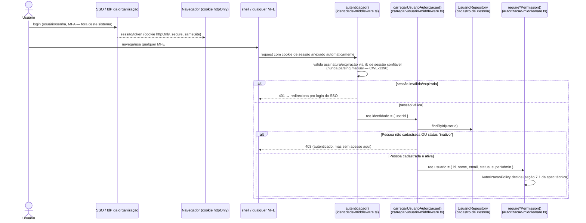
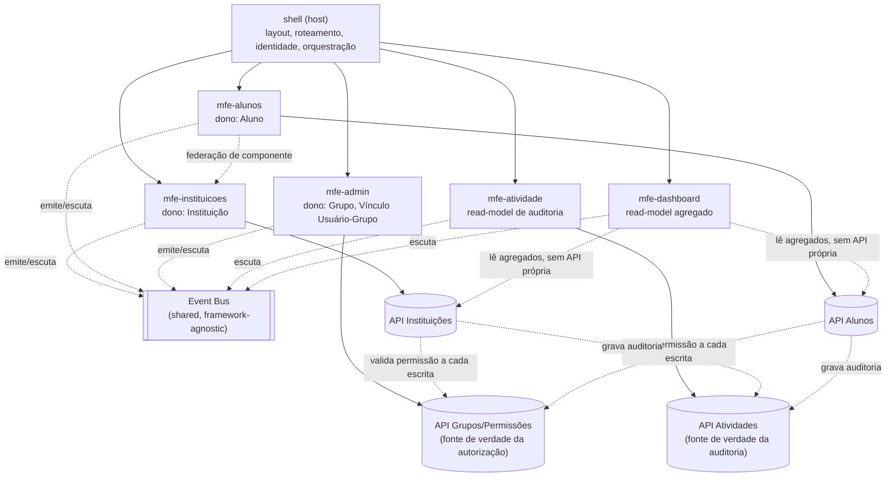
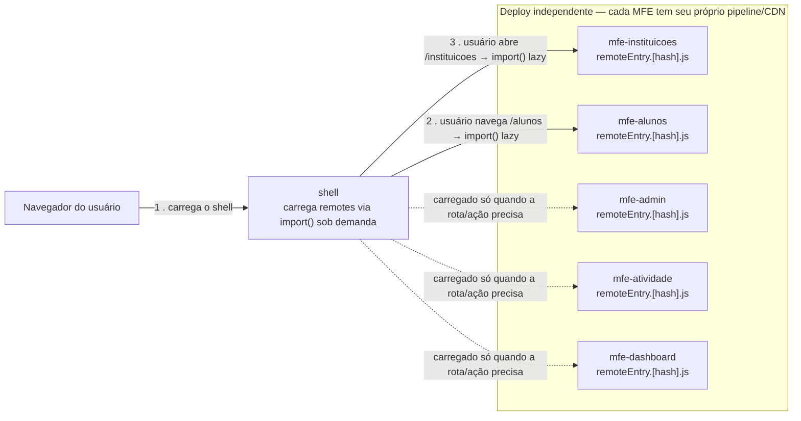
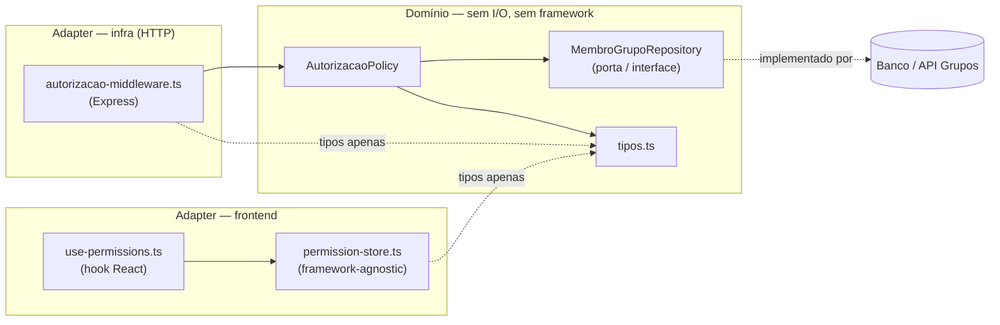
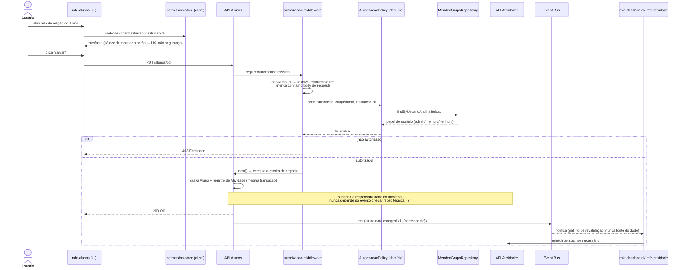
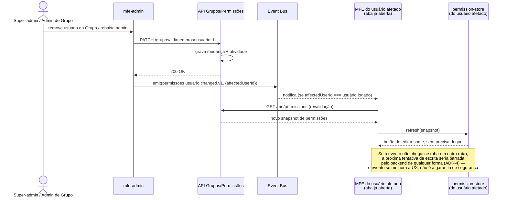

# Diagramas — Sistema de Secretaria Escolar (multi-MFE)

Visualização de ponta a ponta da arquitetura. Ordem sugerida de leitura:
visão geral → composição em runtime → camadas internas do código →
fluxo completo de uma escrita → revogação de permissão em tempo real.

---

## 0. Identidade e autenticação — do login à autorização

**Ponto-chave**: duas checagens distintas, nunca fundidas em uma só —
"está autenticado?" (SSO, fora do nosso código) e "está cadastrado e ativo
aqui?" (nosso `UsuarioRepository`, o CRM interno gerido pelo `mfe-admin`).
Uma pessoa pode passar na primeira e falhar na segunda (ex: alguém que saiu
do time de secretaria continua autenticando no SSO da empresa, mas foi
inativada aqui).

---

## 1. Visão geral de arquitetura (composição de MFEs)

**Como ler**: linhas cheias = dependência de composição (shell monta o MFE) ou
chamada de API direta. Linhas pontilhadas = acoplamento fraco (evento,
federação de componente, backend-a-backend). Repare que `mfe-dashboard` e
`mfe-atividade` não têm API própria de escrita — são puros read-models.

---

## 2. Composição em runtime (Module Federation)

**Ponto-chave**: a composição acontece em **runtime**, no navegador do
usuário — não em build time. Isso é o que permite deploy independente por
time: `mfe-alunos` pode publicar uma versão nova às 15h sem coordenar com
`mfe-instituicoes`, porque o shell só busca o `remoteEntry.js` mais recente
na próxima navegação. O hash no nome do arquivo (seção de performance da
spec técnica) é o que permite cache agressivo em CDN sem servir bundle
desatualizado.

---

## 3. Camadas internas do código (Clean Architecture)

**Ponto-chave**: as setas nunca saem do domínio em direção a infra/frontend —
só entram. `AutorizacaoPolicy` não importa Express nem React; quem depende
dela são os adapters. É essa inversão que permite trocar a implementação de
`MembroGrupoRepository` (Postgres hoje, um motor de política real como
`@platsec-security/authz` amanhã) sem tocar middleware nem hook.

---

## 4. Fluxo completo de uma escrita — editar um Aluno (ponta a ponta)

Este diagrama amarra tudo que foi desenhado na conversa: UX de permissão
(client), decisão real de autorização (backend, ADR-4), resolução segura do
recurso (CWE-639), auditoria confiável (backend, não frontend), e
propagação por evento como sinal — não como dado.

---

## 5. Revogação de permissão em tempo quase real

