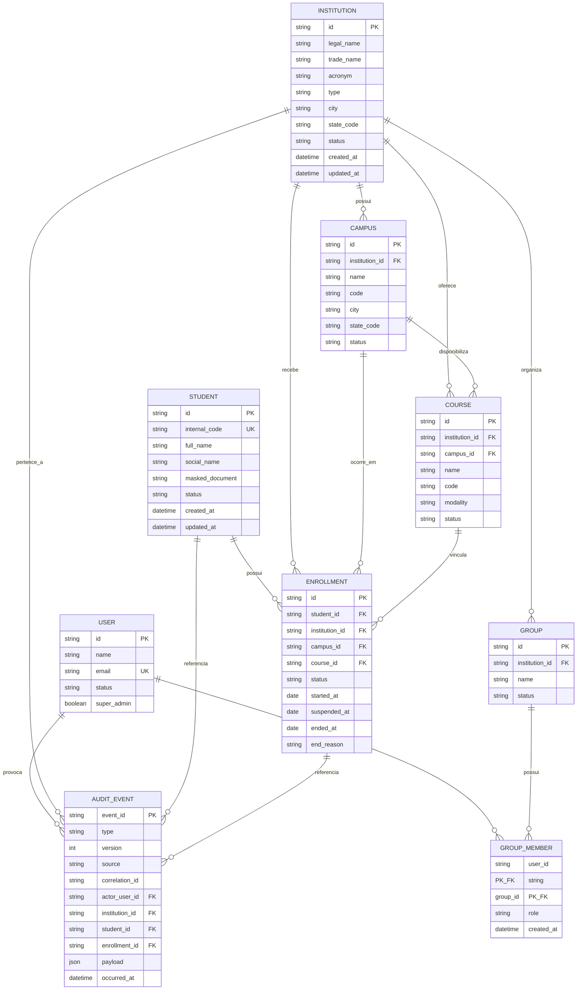

# Diagramas do banco e da arquitetura

## Modelo relacional inicial

O banco usa MariaDB/MySQL. O estudante possui um cadastro único; o vínculo
com uma instituição fica em `enrollments`, permitindo transferência,
trancamento, reabertura e histórico sem duplicar o estudante.

## Regras de relacionamento

- Uma `INSTITUTION` pode possuir vários `CAMPUS`.
- Uma `INSTITUTION` pode oferecer vários `COURSE`.
- Um `COURSE` pertence a uma instituição e pode estar associado a um campus.
- Um `STUDENT` não aponta diretamente para uma instituição.
- Um `STUDENT` possui um ou mais `ENROLLMENT` ao longo do tempo.
- O MVP permite no máximo um `ENROLLMENT` com status `active` por estudante.
- Uma transferência encerra o vínculo de origem e cria o vínculo de destino
	na mesma transação MariaDB/MySQL.
- Um trancamento altera o status do vínculo para `suspended` sem excluir
	histórico; a reabertura retorna para `active`.
- `GROUP_MEMBER` resolve a relação muitos-para-muitos entre usuários e grupos.
- O papel do usuário é aplicado dentro do escopo do grupo/instituição.
- `AUDIT_EVENT` é persistido antes de ser distribuído pelo WebSocket.
- Activity pode projetar eventos a partir de `AUDIT_EVENT`; Dashboard pode
	manter projeções derivadas, mas não substitui os dados autoritativos.

## Constraints obrigatórias

- `institution.id`, `campus.id`, `course.id`, `student.id`,
	`enrollment.id` e `user.id` são chaves primárias.
- `student.internal_code` é único conforme a regra de identificação adotada.
- `user.email` é único.
- `enrollment.student_id`, `institution_id`, `course_id` e status são
	obrigatórios.
- Foreign keys devem estar ativas.
- Transferência e mudança de matrícula devem usar transação.
- Datas de encerramento não podem ser anteriores à data de início.
- Documentos pessoais não devem ser usados como chave pública nem aparecer em
	logs.
- O payload completo do evento deve respeitar a política de minimização de
	dados e, se necessário, ser criptografado ou protegido por acesso.

## Decisões ainda necessárias antes das migrations

- Definir se `internal_code` é único globalmente ou apenas dentro da
	instituição.
- Definir se um curso pode existir em mais de um campus sem duplicação.
- Escolher o formato de ID: UUID ou string gerada pela aplicação.
- Definir o mecanismo de migrations Go.
- Definir política de retenção de `AUDIT_EVENT`.
