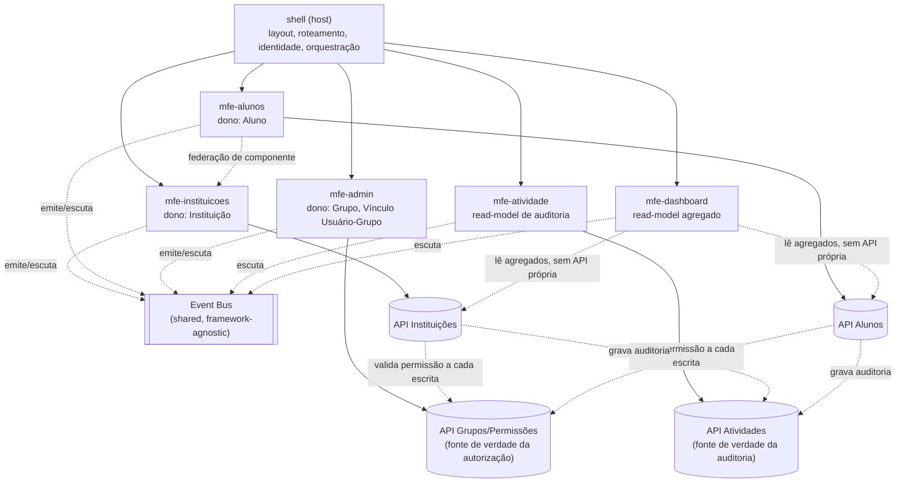
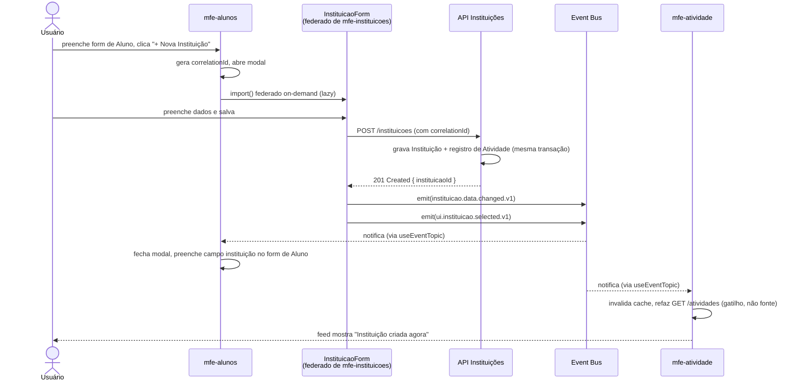

# Spec Técnica — Sistema de Secretaria Escolar (multi-MFE)

## 1. Visão arquitetural



Pontos-chave do diagrama:
- O **event bus** é uma dependência compartilhada via Module Federation
  (`shared`), mas **não depende de React** — sobrevive a MFEs em versões
  diferentes de framework (seção 6).
- `mfe-dashboard` e `mfe-atividade` **não são donos de entidade nenhuma** —
  são puramente projeções/read-models. Isso é proposital: exercita o padrão
  "coreografia com leitor read-only" sem risco de duplicar fonte de verdade.
- A seta pontilhada `Alu -. federação de componente .-> Inst` é o caso de uso
  4.3 da spec funcional (cadastro rápido de instituição embutido no fluxo de
  aluno) — detalhado na seção 4.
- As setas `API_Inst/API_Alu -. valida permissão .-> API_Admin` são
  **backend-a-backend** — nenhum MFE decide autorização, só exibe/esconde UI
  com base no que a API Admin informou (seção 7.1).

## 1.1 Identidade e autenticação — o limite deste sistema

**Autenticação** (quem é) é resolvida por uma camada anterior — SSO/IdP da
organização — nunca por este sistema. Isso é deliberado, não uma lacuna:
reimplementar validação de token/sessão dentro da aplicação é o padrão de
vulnerabilidade CWE-1390 (Missing Authentication) — identidade precisa vir
de uma fonte que o client não controla (assinatura validada, cookie
`httpOnly`), nunca de um header ou query param que o próprio navegador
poderia forjar.

**Autorização** (o que pode) é dado deste sistema — Pessoa, Grupo, papel,
`superAdmin` — gerido pelo `mfe-admin`. A ponte entre as duas etapas é
sempre, nesta ordem:

1. `autenticacao()` (`src/infra/identidade-middleware.ts`) — delega a
   validação de sessão/token para uma lib de sessão/OIDC confiável (nunca
   parsing manual dentro do código da aplicação); resolve só um id estável
   (`userId`), sem saber nada sobre Grupo ou permissão.
2. `carregarUsuarioAutorizacao()` (`src/infra/carregar-usuario-middleware.ts`)
   — busca esse `userId` no cadastro de Pessoa **deste** sistema. Bloqueia
   com **403** (não 401 — a pessoa está autenticada, só não tem acesso
   aqui) em dois casos: Pessoa nunca cadastrada, ou cadastrada com
   `status: "inativo"`. Só depois disso `req.usuario` chega íntegro nos
   middlewares de autorização (seção 7.1).

O `id` da Pessoa (`UsuarioRepository`, `src/domain/usuario-repository.ts`)
é a mesma identidade estável emitida pelo SSO (ex: e-mail corporativo) —
essa correspondência é a única coisa que liga "alguém que autenticou" a
"alguém com acesso aqui dentro". Ver diagrama 0 em `diagramas.md` para o
fluxo completo, do login ao `AutorizacaoPolicy`.

## 2. O que cada MFE expõe via Module Federation

```js
// mfe-instituicoes/webpack.config.js (module federation plugin)
exposes: {
  "./App": "./src/App",                     // página completa
  "./InstituicaoForm": "./src/InstituicaoForm", // form isolado, embutível
  "./InstituicaoSelect": "./src/InstituicaoSelect", // dropdown reutilizável
}
```

```js
// mfe-alunos/webpack.config.js
exposes: {
  "./App": "./src/App",
}
```

```js
// mfe-atividade/webpack.config.js
exposes: {
  "./App": "./src/App",
  "./ActivityFeed": "./src/ActivityFeed", // <ActivityFeed entityType entityId /> — embutível em qualquer tela
}
```

```js
// mfe-admin/webpack.config.js
exposes: {
  "./App": "./src/App", // gestão de Grupos/membros, restrito a super-admin/admin de grupo
}
```

`mfe-admin` acumula três responsabilidades correlatas (Pessoa, Grupo,
Vínculo) porque compartilham o mesmo público (super-admin) e o mesmo
workflow — cadastrar uma Pessoa e já colocá-la num Grupo é uma tarefa só do
ponto de vista de quem administra. `mfe-admin` não expõe componente
embutível em outros domínios — diferente de `InstituicaoForm`/`ActivityFeed`,
gestão de permissão é uma tela própria, não algo que outro MFE deveria
montar dentro de si.

Federar em nível de **componente**, não só de página, é o que permite o caso
de uso 4.3 e o feed de atividade contextual (seção 4.4 da spec funcional).

## 3. Os três mecanismos de integração — e quando usar cada um

| Mecanismo | Quando | Neste sistema |
|---|---|---|
| **Chamada de API direta** | Dado de referência compartilhado, não efêmero | `mfe-alunos` busca lista de instituições direto na API de Instituições para popular filtros — não pede isso ao `mfe-instituicoes` |
| **Federação de componente** | Reuso de UI/lógica de outro domínio | `InstituicaoForm` e `InstituicaoSelect`, federados de `mfe-instituicoes`, usados dentro de `mfe-alunos`; `ActivityFeed` federado de `mfe-atividade`, usado em qualquer tela |
| **Evento (pub/sub)** | Sincronização efêmera de estado entre telas já montadas | Toda a comunicação de "algo mudou, revalide" entre domínios |

Regra de ouro que orienta a tabela acima: **evento nunca carrega a verdade do
dado, só sinaliza que ela mudou.** Quem quer o dado de verdade, busca na API
dona dele.

## 4. Contratos de evento

Convenção de nome: `secretaria.<dominio>.<categoria>.<acao>.<versao>`

| Tópico | Categoria | Payload | Propósito |
|---|---|---|---|
| `secretaria.instituicao.data.changed.v1` | dado | `{ instituicaoId, changeType: "created"\|"updated"\|"inactivated", correlationId }` | Avisa que algo mudou na Instituição X — consumidor deve revalidar, não confiar no payload |
| `secretaria.aluno.data.changed.v1` | dado | `{ alunoId, instituicaoId, changeType, correlationId }` | Idem, para Aluno |
| `secretaria.ui.instituicao.selected.v1` | sinal de UI | `{ instituicaoId }` | Coordenação visual (ex: pré-selecionar instituição recém-criada em um form aberto) — pode ser perdido sem problema |
| `secretaria.grupo.data.changed.v1` | dado | `{ grupoId, changeType, correlationId }` | Algo mudou num Grupo (membro adicionado/removido, papel alterado) — consumidor revalida, nunca confia no payload |
| `secretaria.permissoes.usuario.changed.v1` | sinal de UI (com implicação de segurança, ver 7.1) | `{ affectedUserId }` | Avisa que a permissão de um usuário específico pode ter mudado — MFEs devem refazer o fetch de `/me/permissions` se `affectedUserId` for o usuário logado, para refletir revogação/promoção quase em tempo real |

Dois "namespaces" (`data.*` vs `ui.*`) existem para nunca deixar dúvida sobre
se um consumidor pode ou não confiar no payload como fonte de verdade. O
evento de permissão é o único caso "híbrido": é tratado como sinal de UI
(nunca concede nada sozinho), mas seu conteúdo é sensível o bastante para
exigir cuidado extra — ver seção 7.1.

## 5. Event bus

```ts
// pacote compartilhado @secretaria/event-bus — shared via Module Federation,
// singleton, SEM dependência de React (ver seção 6, decisão sobre versões)
type Handler<T> = (payload: T) => void;

class SecretariaEventBus {
  private lastEvent = new Map<string, unknown>(); // replay p/ quem monta depois
  private handlers = new Map<string, Set<Handler<any>>>();

  emit<T>(topic: string, payload: T) {
    logger.info({ topic, correlationId: (payload as any)?.correlationId }, "event.emitted");
    this.lastEvent.set(topic, payload);
    this.handlers.get(topic)?.forEach((h) => h(payload));
  }

  on<T>(topic: string, handler: Handler<T>, replayLast = true) {
    if (replayLast && this.lastEvent.has(topic)) handler(this.lastEvent.get(topic) as T);
    const set = this.handlers.get(topic) ?? this.handlers.set(topic, new Set()).get(topic)!;
    set.add(handler);
    return () => set.delete(handler); // unsubscribe — evita listener zumbi entre montagens
  }
}

export const eventBus = new SecretariaEventBus();
```

```ts
// hook local, dentro de cada MFE, independente da versão de React dele
function useEventTopic<T>(topic: string): T | undefined {
  return useSyncExternalStore(
    (cb) => eventBus.on(topic, () => cb()),
    () => eventBus.getSnapshot(topic)
  );
}
```

`useSyncExternalStore` é o adaptador fino entre o bus (puro JS) e a árvore de
React de cada MFE — funciona independentemente da versão de React usada,
porque não depende de Context.

## 6. Fluxo completo: cadastro rápido de Instituição a partir do Aluno



Pontos que este fluxo exercita, todos já discutidos e agora amarrados:

- **Federação de componente, não de página** — `InstituicaoForm` roda dentro
  do DOM/rota de `mfe-alunos`, mas é código e deploy de `mfe-instituicoes`.
- **Sem callback prop entre domínios** — `InstituicaoForm` não recebe
  `onSuccess`; ele não sabe nem precisa saber quem o invocou. Comunica só via
  evento, o que o mantém reutilizável em qualquer contexto (modal do
  Dashboard, futuro fluxo de Turma, etc.) sem acoplar à API de quem chama.
- **correlationId nasce na ação do usuário**, atravessa a chamada de API (uso
  legítimo de prop aqui — é metadado de rastreio, não estado de negócio) e
  reaparece no payload do evento — permite reconstruir a cadeia inteira em
  observabilidade (seção 9).
- **Atividade nunca confia no payload do evento** — o evento só dispara um
  refetch; o dado exibido vem sempre da API de Atividades.
- **Replay do último evento (`lastEvent`)** garante que, se `mfe-atividade`
  não estivesse montado no instante do `emit`, ele recupera o último estado ao
  montar — mas ele sempre faz um fetch completo/paginado no mount para não
  depender do replay como única fonte de histórico.
- **Isolamento de estilo**: `InstituicaoForm`, por ser injetado dentro do DOM
  de outro MFE, usa CSS Modules (hash de classe) — não pode depender de
  seletor global, sob risco de colidir com estilos de `mfe-alunos`.

## 7. Atividade/Auditoria: onde mora a verdade

Decisão explícita, porque é fácil errar aqui: **a gravação da atividade é
responsabilidade do backend**, no mesmo request/transação da escrita de
negócio (Instituição/Aluno), nunca do frontend reagindo a um clique.

Motivo: se a atividade só existisse porque o frontend emitiu um evento, ela
sumiria sempre que o usuário fechasse a aba antes do evento disparar, ou
sempre que a mutação viesse de outro client (script, Postman, integração)
que não passa pela UI. Isso violaria o requisito não-funcional 7 (spec
funcional) de confiabilidade de auditoria.

O frontend (`mfe-atividade`) tem só duas responsabilidades:
1. Buscar o feed na API de Atividades (dona real do dado).
2. Escutar `*.data.changed.v1` como **gatilho de revalidação em tempo real**,
   para não depender de polling.

## 7.1 Autorização e o módulo `mfe-admin`

Modelo de dados: `Usuário` (identidade vem de fora, seção 6 da spec
funcional) → pertence a N `Grupo` → cada `Grupo` é vinculado a exatamente uma
`Instituição` e tem membros com papel `admin` ou `membro` (leitura). Existe
também um flag `superAdmin` no usuário, independente de Grupo, que passa por
cima de qualquer escopo.

**Regra de ouro, reforçada aqui**: a decisão de autorização é **sempre do
backend**, nunca do frontend — mesmo sendo o frontend federado, distribuído
entre times diferentes. Nenhum MFE decide se uma ação é permitida; ele só
reflete visualmente uma decisão que a API já tomou.

### Onde a permissão "aparece" no frontend

1. No bootstrap do shell, uma única chamada a `GET /me/permissions` retorna
   os grupos do usuário logado, o papel em cada um, e o flag `superAdmin`.
2. Esse resultado é guardado no mesmo tipo de store framework-agnostic usado
   pelo event bus (seção 5) — **não** em React Context, pelo mesmo motivo do
   ADR-1 (cada MFE roda sua própria instância de React). Cada MFE lê via
   `useSyncExternalStore`.
3. `mfe-instituicoes`/`mfe-alunos` usam esse estado só para **UX**: mostrar
   ou esconder o botão de editar. Ao clicar em salvar, a API correspondente
   (`API Instituições`/`API Alunos`) **revalida a permissão de novo**,
   consultando `API Grupos/Permissões` — o frontend nunca é a última palavra.
4. Quando um admin altera o Grupo de alguém (`mfe-admin` grava via
   `API Grupos/Permissões`), o backend emite o dado de verdade, e o frontend
   emite `secretaria.permissoes.usuario.changed.v1` no bus. Quem estiver
   logado como o usuário afetado refaz o `GET /me/permissions` e atualiza a
   UI — cobre o requisito de "revogação quase em tempo real" (spec
   funcional, requisito não-funcional) sem exigir logout. Isso é só
   conforto de UX: mesmo que esse evento nunca chegasse (aba em outra rota,
   race condition), a próxima tentativa de escrita já seria barrada pelo
   backend de qualquer forma — a segurança nunca depende do evento chegar.

### Por que não confiar no event bus para a decisão em si

`window`/`CustomEvent` não tem controle de origem: qualquer script rodando
na página poderia, em tese, disparar
`secretaria.permissoes.usuario.changed.v1` ou até um evento forjado tentando
simular "sou admin agora". Por isso o payload desses eventos nunca carrega a
permissão em si (`{ isAdmin: true }`) — só um `affectedUserId`, que serve
apenas de gatilho para revalidar contra `GET /me/permissions`. Mesmo que
alguém forje o evento, o pior cenário é uma revalidação desnecessária, nunca
uma permissão indevida.

### `mfe-admin`

- CRUD de `Pessoa` (nome, e-mail, status) — o "CRM interno" descrito na
  spec funcional (caso de uso 4.6) e na seção 1.1 desta spec — exclusivo de
  super-admin (`podeGerenciarPessoas`).
- CRUD de `Grupo` (nome, `instituicaoId`) — exclusivo de super-admin.
- Gestão de membros de um Grupo (adicionar/remover pessoa, promover/rebaixar
  admin) — permitido para super-admin (qualquer grupo) e para admin daquele
  Grupo específico (só o próprio).
- A API por trás de `mfe-admin` trata isso como recurso privilegiado: exige
  sua própria permissão (`admin:manage_group`), nunca reaproveita a mesma
  flag usada para "editar aluno" — são autorizações distintas mesmo para a
  mesma pessoa.
- Mudança de papel (promover alguém a admin) é operação sensível o bastante
  para gerar atividade auditável (reaproveita `mfe-atividade`, seção 7) — em
  um sistema real, seria candidata a exigir reautenticação antes de
  confirmar.
- **Nota de stack real**: se isso fosse implementado como app Meli de
  verdade (Nordic/Node.js), o backend usaria `@platsec-security/authz` +
  `@platsec-security/identity` para essas checagens — nunca reimplementar
  parsing de identidade ou verificação de papel na mão. Como este exercício
  é deliberadamente genérico, a spec descreve o *padrão* (identidade de
  fonte confiável, revalidação server-side, escopo por recurso) que
  qualquer SDK de authz real implementaria por baixo.

## 8. Decisões arquiteturais registradas (ADR resumido)

### ADR-1: React independente por MFE (sem singleton forçado)

- **Contexto**: Module Federation permite `shared: { react: { singleton: true } }`
  (uma instância só de React na página) ou deixar cada remote carregar sua
  própria cópia.
- **Decisão**: cada MFE carrega sua própria instância de React, sem
  `singleton`.
- **Consequência aceita**: bundle maior (React duplicado por remote ativo na
  página); nenhum Context React atravessa a fronteira entre MFEs.
- **Benefício buscado**: autonomia real de upgrade por time (um MFE pode
  migrar de versão major sem coordenar com os outros) e — mais importante
  para este projeto — força toda comunicação cross-MFE a passar pelo event
  bus (seção 5), que é framework-agnostic por construção. Isso mantém a
  arquitetura correta mesmo se um domínio futuro decidir não usar React.
- **Quando revisitar**: se a organização adotar cadência de release unificada
  entre os times donos de cada MFE, singleton passa a valer a pena pelo ganho
  de payload.

### ADR-2: MFE por domínio, não CRUD genérico multi-entidade

- **Contexto**: era possível construir um `mfe-crud-generico` orientado a
  schema, atendendo Instituição e Aluno com o mesmo motor de form/tabela.
- **Decisão**: manter `mfe-instituicoes` e `mfe-alunos` como MFEs separados,
  cada um dono só da sua entidade.
- **Motivo**: um motor genérico reuniria dois domínios com ciclo de mudança
  potencialmente diferente num único deployável, anulando o isolamento que
  MFE deveria trazer; motores genéricos tendem a acumular `if (entityType ===
  ...)` conforme regras específicas aparecem (ex: wizard de 2 passos do
  Aluno, máscara de CNPJ da Instituição).
- **Mitigação do DRY perdido**: primitivos de UI comuns (`CrudTable`,
  `FormField`, `DeleteConfirmDialog`) vivem em um pacote de design system
  compartilhado, consumido por ambos os MFEs — reuso na camada de
  apresentação, não na camada de domínio.
- **Quando revisitar**: se surgirem 5+ entidades do tipo tabela-de-apoio
  (nome + status, sem relação com outras entidades), um motor genérico
  específico para essa categoria de entidade simples se paga.

### ADR-4: Autorização é decidida só no backend; frontend só reflete

- **Contexto**: com permissão de escrita agora existindo (Grupo, admin,
  super-admin), seria tentador implementar o bloqueio "esconder botão se não
  for admin" como a própria checagem de segurança, já que é mais simples.
- **Decisão**: nenhuma API (`API Instituições`, `API Alunos`, `API
  Grupos/Permissões`) confia em nada vindo do client para decidir
  autorização — nem estado do event bus, nem prop, nem header customizado.
  Toda checagem usa a identidade resolvida do lado do servidor e consulta a
  fonte de verdade de Grupo/papel a cada escrita.
- **Consequência aceita**: uma chamada extra de validação por escrita (API
  de negócio → API de permissões) — custo de latência pequeno, aceito
  conscientemente em troca de nunca depender do client.
- **Motivo**: numa arquitetura federada com times diferentes, permitir que
  qualquer MFE seja "a fonte" de uma decisão de autorização significa que o
  elo mais fraco (o MFE menos revisado) vira o ponto de bypass do sistema
  inteiro — isso é exatamente o padrão descrito em CWE-862 (Missing
  Authorization) e CWE-841 (Business Logic Abuse): lógica crítica não pode
  depender de parâmetro/estado controlado pelo usuário ou pelo client.

### ADR-3: Instituição não permite exclusão física com alunos vinculados

- **Decisão**: bloqueio, não cascata (regra de negócio 2 da spec funcional).
- **Consequência arquitetural**: evita ter que desenhar uma saga
  client-side de deleção em cascata (`instituicao.delete.requested` →
  `mfe-alunos` reage deletando em lote → confirmação) — fica registrado como
  extensão futura caso a regra de negócio mude.

## 9. Observabilidade e logging

- **Log estruturado**: instrumentar o event bus (não cada componente
  individualmente) — todo `emit`/`on` gera log `{ topic, correlationId,
  timestamp }`, nunca o payload de negócio completo (evita vazar dado de
  aluno em log). Ferramenta: `pino` (browser build), leve e sem infraestrutura
  extra para começar.
- **Rastreamento distribuído (evolução futura)**: migrar `correlationId`
  manual para span do **OpenTelemetry Web SDK**, exportando para **Grafana
  Tempo** ou **Jaeger** (ambos gratuitos, self-hosted) — permite visualizar a
  cadeia completa do fluxo da seção 6 como uma única timeline.
  Alternativa hospedada gratuita para captura de erro/performance:
  **Sentry** (tier free ou self-hosted), útil especificamente para o cenário
  de falha de carregamento de remote (seção 10).

## 10. Performance e escalabilidade

- **Carregamento**: cada MFE via `import()` lazy por rota; prefetch no hover
  do menu de navegação do shell.
- **Shared deps**: `react`/`react-dom` **não** são singleton (ADR-1) — custo
  aceito conscientemente; demais libs utilitárias (design system, date-fns
  etc.) seguem `singleton: true` normalmente, pois não têm o problema de
  Context cross-fronteira.
- **Orçamento de bundle por MFE**: budget de tamanho validado em CI (ex: 60kb
  gzip de código próprio, sem contar shared).
- **Isolamento de falha de carregamento**: error boundary por rota federada
  no shell — falha ao baixar `mfe-alunos` não derruba `mfe-instituicoes`.
- **Escala de dados** (requisito não-funcional da spec funcional):
  - Listagem de Aluno e Instituição: paginação cursor-based, nunca
    "carregar tudo".
  - `InstituicaoSelect`: a partir de um certo volume, deixa de ser um
    `<select>` com todas as opções em memória e vira busca com debounce
    (typeahead) contra a API, paginada.
  - Considerar **BFF por MFE** (em vez de todos batendo na mesma API
    monolítica) se o volume de times/domínios crescer — cada domínio expõe
    só o que seu MFE precisa, evitando over-fetching.
- **Cache de `remoteEntry.js`**: nome de arquivo com content-hash por deploy,
  para permitir cache agressivo em CDN sem risco de servir bundle
  desatualizado após um novo deploy de um remote.

## 11. Segurança

- `CustomEvent`/bus global no `window` não tem controle de origem — qualquer
  script na página pode forjar um evento com o nome certo. Mitigação:
  validar payload recebido contra schema (Zod) antes de processar, e nunca
  tratar o conteúdo de um evento como autorizado a executar ação sensível
  (ex: nunca deletar algo só porque um evento pediu — sempre revalidar
  contra a API antes de qualquer efeito colateral real). Isso vale
  especialmente para `secretaria.permissoes.usuario.changed.v1` (seção 7.1):
  o payload nunca carrega a permissão em si, só um gatilho de revalidação.
- `InstituicaoForm` federado dentro de `mfe-alunos` ainda faz sua própria
  chamada de API — não recebe token/sessão via prop; usa o mesmo mecanismo de
  auth do host (cookie/sessão compartilhada de domínio), não reinventa auth
  por MFE.
- Nenhum MFE faz parsing manual de token/claims de sessão por conta própria —
  identidade é resolvida uma vez (shell ou BFF comum) a partir de fonte
  confiável, nunca de headers/query params que o próprio client poderia
  manipular (CWE-1390, CWE-639).
- Toda escrita em Instituição/Aluno/Grupo é revalidada no backend contra
  `API Grupos/Permissões` a cada request — nunca assume que o botão só
  aparecer para admin já é suficiente (ADR-4).
- O módulo `mfe-admin` é ele mesmo um recurso privilegiado: sua API exige
  permissão própria (`admin:manage_group`), distinta da permissão de editar
  Aluno/Instituição, evitando que uma escalada indevida numa reaproveite a
  outra.

## 12. Testes

- **Contract testing**: pacote `@secretaria/event-contracts` com schema Zod
  por tópico, versionado por semver; CI de cada MFE valida payload real
  contra o schema antes de publicar.
- **Unit/integração por MFE**: cada domínio testa sua lógica isoladamente,
  mockando o event bus.
- **E2E do fluxo cross-domínio**: pelo menos o fluxo da seção 6 (cadastro
  rápido de instituição a partir do aluno) precisa de teste end-to-end real,
  porque é o único ponto onde federação de componente + evento + backend se
  cruzam ao mesmo tempo — contract test sozinho não pega problema de
  composição de UI (ex: CSS vazando, modal não fechando).

## 13. Stack de infraestrutura (100% gratuita, para fins de estudo)

Escolhas validadas em ago/2026 — free tiers mudam de termo com frequência
(o próprio free tier do Heroku foi descontinuado em nov/2022); **revalidar
no site do provedor antes de qualquer deploy real**, não confiar só nesta
tabela.

| Camada | Serviço escolhido | Por quê | Ressalva |
|---|---|---|---|
| Frontend (shell + 5 MFEs) | **Cloudflare Pages** | Bandwidth **ilimitado** no free tier e uso comercial permitido — um projeto por MFE. Importa porque duplicar React por MFE (ADR-1) infla o payload total; ilimitado remove essa preocupação | 500 builds/mês no free — de sobra pra estudo |
| Backend (APIs de domínio) | **Render** (1 Web Service free, Express único, modular por domínio — não um serviço por domínio) | Consolidar em um serviço evita somar N cold-starts de N serviços separados | Free web service dorme após 15 min de inatividade, cold start de 30-60s — aceitável pra estudo, não pra produção real |
| Banco de dados | **Neon** (Postgres free) | Scale-to-zero, mas **sem expiração forçada dos dados** | Não usar o Postgres free do próprio Render — esse é apagado automaticamente aos 90 dias |
| Autenticação/SSO (seção 1.1) | **Clerk** (free até 50k MRU) | Emite sessão/JWT real validável via SDK oficial — dá pra implementar `autenticacao()` sem nunca fazer parsing manual de token (CWE-1390), com componentes React prontos de login | Alternativa: Auth0 (free até 25k MAU), mais "enterprise", mais fricção de setup |
| Event bus | Nenhum serviço — 100% client-side | `window`/`CustomEvent` não tem custo de infraestrutura por natureza | — |

Alternativas de frontend igualmente válidas, caso Cloudflare Pages não
agrade: Netlify (100GB bandwidth free, uso comercial permitido) ou Vercel
Hobby (100GB, mas **proíbe uso comercial** — ok para este exercício de
estudo, não para um produto real).

## 14. Extensões futuras (fora de escopo, mas desenhadas para caber)

- Nova entidade (ex: Turma): novo MFE `mfe-turmas`, novos tópicos
  `secretaria.turma.data.changed.v1`, sem alterar o bus nem os MFEs
  existentes.
- Exclusão em cascata de Instituição: viraria uma saga client-side
  orquestrada explicitamente pelo shell (não coreografia pura), dado o efeito
  colateral em outro domínio.
- Multi-tenant: mudaria o `correlationId`/contexto para incluir
  `tenantId`, propagado desde a origem do evento.
